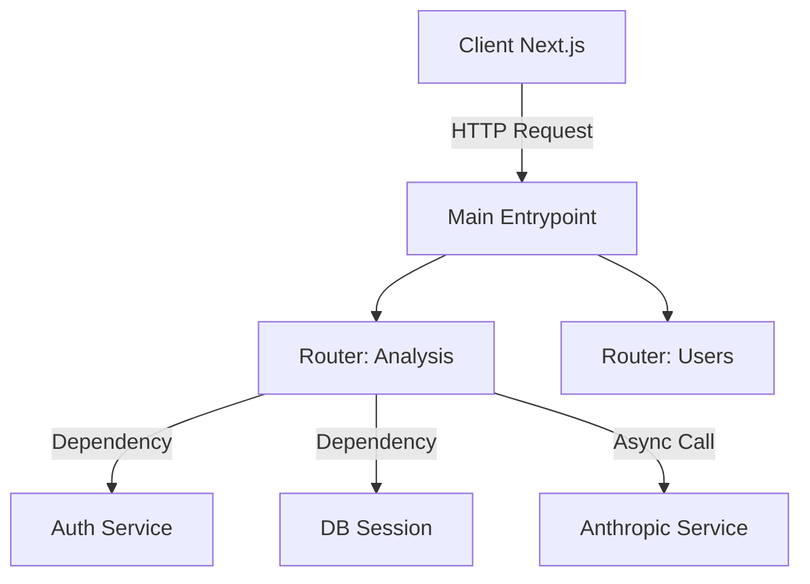

# MODULE 1 : FASTAPI FUNDAMENTALS & ARCHITECTURE

**Objectif :** Dépasser le "Hello World" pour structurer une API prête pour la production, capable de gérer la charge asynchrone et de valider strictement les données (indispensable pour le secteur légal/financier US).

---

## 1. DEEP DIVE THÉORIQUE

### A. L'Event Loop & ASGI (Pourquoi FastAPI est rapide)

Contrairement à Flask ou Django (WSGI) qui bloquent un thread par requête, FastAPI repose sur **ASGI** (Asynchronous Server Gateway Interface).

- **Concept clé :** `async def`. Quand tu fais un appel à Anthropic (qui prend 2-10 secondes), ton serveur ne doit pas dormir. Il doit mettre la tâche en pause (`await`) et traiter d'autres requêtes (ex: paiements Stripe).
- **Impact Business :** Avec un serveur à 7$ (Render/DigitalOcean), tu peux gérer des milliers de connexions simultanées si ton code est non-bloquant.

### B. Dependency Injection (DI)

Le système de DI de FastAPI (`Depends`) est son arme secrète. Il permet de :

- Partager la logique (ex: vérifier un token User).
- Gérer les connexions DB (ouvrir/fermer proprement).
- Faciliter les tests (mocker la DB ou l'API Anthropic).

### C. Structure de Projet "Scalable"

On ne met pas tout dans `main.py`. Pour **LeaseLens AI**, nous utiliserons une structure modulaire.



---

## 2. CADRE RÉGLEMENTAIRE & BUSINESS (US FOCUS)

**Data Privacy (CCPA - California Consumer Privacy Act) :**
- Même en MVP, tu dois savoir où vont les données. FastAPI permet de filtrer les données de sortie via `response_model` pour ne jamais exposer accidentellement des infos sensibles (PII) contenues dans un bail.

**Latency & Region :**
- Pour le marché US, héberge ton backend sur **US-East** (N. Virginia) ou **US-West** (Oregon). Ne laisse pas tes serveurs à Paris. Cela réduit la latence pour tes clients californiens.

---

## 3. INDUSTRY BEST PRACTICES

- **Typage Strict :** Utilise toujours Pydantic. Pas de dictionnaires vagues.
- **Versioning :** `/api/v1/...`. Si tu changes ton modèle de données, tu ne casses pas le frontend.
- **Environment Variables :** `pydantic-settings`. Ne hardcode JAMAIS ta clé API Anthropic.

---

## 4. EXERCICE D'APPLICATION (DRILL)

**Scénario :** Créer un micro-service de "Scoring de Crédit" (fictif). L'API doit accepter une demande, simuler un calcul long (appel externe), et retourner un résultat typé.

### Setup (Terminal)

```bash
mkdir fast_training && cd fast_training
python3 -m venv venv
source venv/bin/activate
pip install fastapi "uvicorn[standard]" pydantic pydantic-settings
```

### Le Code (`main.py` & `schemas.py` & `deps.py`)

> Je vais tout combiner ici pour la lisibilité, mais en prod, sépare les fichiers.

```python
import asyncio
import time
from typing import Annotated, Optional
from fastapi import FastAPI, Depends, HTTPException, status, Header
from pydantic import BaseModel, Field, EmailStr
from enum import Enum

# --- 1. SCHEMAS (Pydantic) ---
# Validation stricte des entrées/sorties

class CreditScoreTier(str, Enum):
    POOR = "poor"
    GOOD = "good"
    EXCELLENT = "excellent"

class UserRequest(BaseModel):
    # Field permet d'ajouter des métadonnées pour la doc API (Swagger UI)
    email: EmailStr
    annual_income: float = Field(gt=0, description="Annual income in USD")
    ssn_last_4: str = Field(min_length=4, max_length=4, pattern=r"^\d{4}$")

class ScoreResponse(BaseModel):
    score: int
    tier: CreditScoreTier
    approved_limit: float
    processing_time_ms: float

# --- 2. CONFIG & DEPENDENCIES ---

# Simulation d'une clé API secrète (ex: venant d'Anthropic)
def get_api_key(x_api_key: Annotated[str | None, Header()] = None):
    """
    Simule une sécurité basique. 
    En prod, on utiliserait OAuth2 ou une vraie gestion de clé.
    """
    if x_api_key != "secret-training-key":
        raise HTTPException(
            status_code=status.HTTP_401_UNAUTHORIZED,
            detail="Invalid or missing API Key"
        )
    return x_api_key

# --- 3. BUSINESS LOGIC (Service Layer) ---

async def calculate_score_algorithm(income: float) -> int:
    """
    Simule un appel asynchrone lent (ex: appel à Claude 3.5 Sonnet).
    Note le 'await asyncio.sleep' qui ne bloque pas le serveur.
    """
    await asyncio.sleep(1.5)  # Simule 1.5s de processing

    # Logique bidon pour l'exercice
    base_score = 600
    if income > 100000:
        return base_score + 150
    elif income > 50000:
        return base_score + 50
    return base_score

# --- 4. APPLICATION ---

app = FastAPI(
    title="US Credit Score API",
    description="Training Module 1 - Async & Validation",
    version="1.0.0"
)

@app.get("/")
async def health_check():
    return {"status": "active", "region": "US-WEST-1"}

@app.post(
    "/v1/calculate-score", 
    response_model=ScoreResponse,
    status_code=status.HTTP_200_OK
)
async def get_credit_score(
    request: UserRequest,
    api_key: Annotated[str, Depends(get_api_key)]  # Injection de dépendance
):
    start_time = time.time()

    # Appel de la logique asynchrone
    score = await calculate_score_algorithm(request.annual_income)

    # Détermination du Tier
    tier = CreditScoreTier.POOR
    limit = 0.0

    if score >= 750:
        tier = CreditScoreTier.EXCELLENT
        limit = request.annual_income * 0.10
    elif score >= 650:
        tier = CreditScoreTier.GOOD
        limit = request.annual_income * 0.05

    duration = (time.time() - start_time) * 1000

    return ScoreResponse(
        score=score,
        tier=tier,
        approved_limit=limit,
        processing_time_ms=round(duration, 2)
    )

# Pour lancer : uvicorn main:app --reload
```

---

## 5. INSTRUCTIONS POUR L'EXERCICE

1. Copie ce code dans `main.py`.
2. Lance le serveur : `uvicorn main:app --reload`.
3. Ouvre la documentation automatique : http://127.0.0.1:8000/docs. C'est ton meilleur ami.
4. **Le Test :** Essaie d'envoyer une requête via le Swagger UI (bouton "Try it out").
   - Mets un email invalide → Observe l'erreur **422** (Validation Pydantic).
   - Oublie le header `x-api-key` → Observe l'erreur **401** (Dependency).
   - Remplis tout correctement → Observe le temps de réponse (environ 1.5s).

---

## 6. APPLICATION AU PROJET FINAL (LeaseLens AI)

Ce que nous avons appris aujourd'hui servira directement ce weekend :

- `UserRequest` deviendra `LeaseUploadRequest` (recevant le texte extrait du PDF).
- `calculate_score_algorithm` deviendra `analyze_lease_clauses` (l'appel à Anthropic).
- `ScoreResponse` deviendra `ComplianceReport` (la liste des clauses illégales structurées).
- **L'aspect Async est critique :** l'analyse d'un bail de 50 pages par Anthropic peut prendre 30 secondes. Il ne faut pas bloquer le serveur pendant ce temps.

---

## 7. RESSOURCES DU JOUR

### FastAPI Documentation (Official)
[Doc Officielle](https://fastapi.tiangolo.com/)  
**Utilité :** La meilleure documentation de l'écosystème Python. Lis la section "Concurrency and async / await".

### Pydantic V2 Migration Guide
[Doc Technique](https://docs.pydantic.dev/latest/migration/)  
**Utilité :** Pydantic V2 (utilisé par Pydantic AI) est beaucoup plus rapide (écrit en Rust) mais change légèrement la syntaxe par rapport à la V1.

---

## TÂCHE POUR DEMAIN :

Fais tourner le code ci-dessus. Modifie-le pour ajouter un champ `state` (ex: "CA", "NY", "TX") dans la requête et **rejette la requête** si ce n'est pas "CA" (Raise `HTTPException`). Cela simulera notre focus sur la Californie.

**Confirme quand c'est fait ou si tu as des questions sur l'asynchrone.**