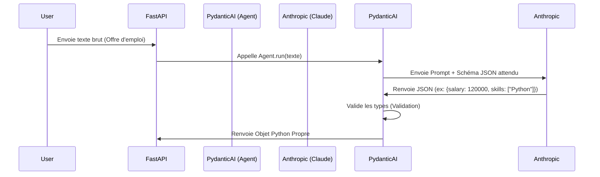

# MODULE 2 : PYDANTIC & STRUCTURATION D'IA

**Objectif :** L'IA ne doit pas juste "blablater". Elle doit renvoyer des données utilisables par le code. Nous allons apprendre à forcer le LLM (Anthropic) à respecter un schéma strict défini en Python. C'est le cœur de ton backend.

## 1. THÉORIE : DU TEXTE AU JSON (STRUCTURED OUTPUT)

Dans le développement moderne d'IA (AI Engineering), on ne demande plus à l'IA de renvoyer du texte brut. On lui demande de remplir des classes.

### Pourquoi Pydantic V2 est une révolution ?
*   **Validation Runtime :** Si le LLM renvoie un salaire sous forme de string ("50k") alors que tu attends un integer (50000), Pydantic va tenter de le convertir ou lever une erreur *avant* que ton code ne plante.
*   **Intégration LLM :** Les modèles comme Claude 3.5 sont entraînés pour comprendre les schémas JSON. Pydantic génère ce schéma automatiquement pour "guider" le LLM.

### Diagramme de Flux : Pydantic AI Agent


## 2. DEEP DIVE : PYDANTIC AI & ANTHROPIC

Nous utilisons la librairie `pydantic-ai`. Elle sert de "colle" typée entre ton code et le modèle Anthropic.

**Concept Clé : Le `ResultType`**
C'est la classe qui définit ce que tu veux obtenir à la fin.
Pour *Resume Rocket*, nous ne voulons pas une lettre de motivation en texte brut. Nous voulons un objet contenant : la lettre, le score de compatibilité, et les compétences manquantes.

## 3. EXERCICE DU JOUR : LE "JOB PARSER"

Nous allons construire la brique qui analyse l'offre d'emploi (Job Description).
L'utilisateur colle un texte en vrac (copié de LinkedIn), et ton API renvoie une structure propre.

### Setup (Terminal)
```bash
pip install pydantic-ai anthropic nest_asyncio
# Assure-toi d'avoir ta clé ANTHROPIC_API_KEY dans tes variables d'environnement
```

### Le Code (À placer dans un fichier `drill_module_2.py`)

```python
import os
import nest_asyncio
from typing import List, Optional
from pydantic import BaseModel, Field
from pydantic_ai import Agent
from pydantic_ai.models.anthropic import AnthropicModel

# Patch pour les notebooks/scripts simples asyncio
nest_asyncio.apply()

# --- 1. DÉFINITION DU MODÈLE DE DONNÉES (Le Contrat) ---
# C'est ce que nous voulons extraire du chaos du texte.

class SalaryRange(BaseModel):
    min_salary: Optional[int] = Field(None, description="Salaire minimum annuel en USD")
    max_salary: Optional[int] = Field(None, description="Salaire maximum annuel en USD")
    currency: str = Field("USD", description="Devise, ex: USD, EUR")

class JobAnalysis(BaseModel):
    job_title: str = Field(..., description="Le titre normalisé du poste")
    company_name: Optional[str] = Field(None, description="Nom de l'entreprise si mentionné")
    required_skills: List[str] = Field(..., description="Liste des compétences techniques exigées (Hard Skills)")
    years_experience: Optional[int] = Field(None, description="Années d'expérience minimum requises")
    is_remote: bool = Field(False, description="True si le poste mentionne 'Remote' ou 'Télétravail'")
    salary: Optional[SalaryRange] = Field(None, description="Fourchette de salaire si mentionnée")
    risk_score: int = Field(..., description="Score de 0 à 100. 100 = Offre suspecte ou toxique.")

# --- 2. CONFIGURATION DE L'AGENT ---

# On utilise Claude 3.5 Sonnet (Le meilleur pour le code/structure)
model = AnthropicModel('claude-3-5-sonnet-latest', api_key=os.getenv("ANTHROPIC_API_KEY"))

agent = Agent(
    model,
    result_type=JobAnalysis, # <--- LA MAGIE EST ICI. On force le type de retour.
    system_prompt=(
        "Tu es un expert en recrutement US (Californie)."
        "Tu analyses des descriptions de poste brutes."
        "Extrais les informations clés."
        "Pour le risk_score, analyse le ton: mots clés comme 'Rockstar', 'Ninja', 'Work hard play hard' augmentent le risque."
    ),
)

# --- 3. EXECUTION ---

async def analyze_job_posting(raw_text: str):
    print(f"Analyzing job description... ({len(raw_text)} chars)")
    
    # L'agent va faire l'aller-retour avec Anthropic et valider le JSON
    result = await agent.run(raw_text)
    
    return result.data

# --- 4. TEST DE L'APP ---

if __name__ == "__main__":
    import asyncio
    
    # Exemple d'offre "Toxique" typique de la Silicon Valley
    bad_job_offer = """
    WE ARE HIRING A 10x ENGINEER!!
    Startup based in San Francisco looking for a Rockstar Developer.
    Must know Python, Rust, React, Kubernetes, and Assembly.
    Salary: Competitive (Equity only for first 6 months).
    We work hard and play hard. No 9-5 mentality here!
    """

    try:
        data = asyncio.run(analyze_job_posting(bad_job_offer))
        
        print("\n--- RÉSULTAT STRUCTURÉ ---")
        print(f"Poste: {data.job_title}")
        print(f"Compétences: {data.required_skills}")
        print(f"Remote: {data.is_remote}")
        print(f"Score de Toxicité: {data.risk_score}/100")
        
        if data.salary and data.salary.min_salary:
            print(f"Salaire: {data.salary.min_salary}$")
        else:
            print("Salaire: Non spécifié (Attention: Illégal en Californie depuis 2023 pour les boites >15 employés)")
            
    except Exception as e:
        print(f"Erreur: {e}")
```

## 4. INSTRUCTIONS POUR L'EXERCICE

1.  Installe les dépendances.
2.  Exporte ta clé API Anthropic : `export ANTHROPIC_API_KEY='sk-...'` (Mac/Linux) ou `$env:ANTHROPIC_API_KEY='sk-...'` (PowerShell).
3.  Lance le script.
4.  **Observe :** Regarde comment l'IA a converti le texte vague "Equity only" en absence de salaire, et comment elle a détecté le score de toxicité élevé basé sur les mots-clés "Rockstar" et "No 9-5".

## 5. APPLICATION AU PROJET "RESUME ROCKET"

Ce module est la **brique d'entrée** de ton projet final.
1.  L'utilisateur colle l'URL ou le texte.
2.  Ce script nettoie l'offre pour en extraire `required_skills`.
3.  Dans le **Module 3 (RAG)**, nous utiliserons ces `required_skills` comme requête (query) pour aller chercher dans le CV de l'utilisateur les preuves qu'il possède ces compétences.