# MODULE 3 : RAG & EMBEDDINGS (Le Moteur de Recherche Sémantique)

**Objectif :** Construire un moteur de recherche interne capable de scanner un "Master CV" (long et dense) pour y trouver *uniquement* les preuves correspondant aux compétences demandées par l'offre.

## 1. DEEP DIVE THÉORIQUE : VECTEURS & SÉMANTIQUE

### Le Concept
Un ordinateur ne comprend pas le sens des mots. Pour lui, "Coder" et "Programmer" sont deux chaînes de caractères totalement différentes.
Pour régler ça, on transforme le texte en **Vecteurs** (des listes de nombres, ex: `[0.12, -0.98, 0.05...]`).

*   Dans cet espace mathématique, "Coder" et "Programmer" sont géométriquement proches.
*   "Banane" est très loin.

### L'Architecture "Ephemeral RAG" (Spécifique Resume Rocket)
Contrairement aux tutos classiques qui stockent des données pour toujours, ton SaaS doit être **Stateless** (pour la sécurité).

1.  **Ingest :** L'utilisateur upload son CV.
2.  **Chunking :** On découpe le CV en petits morceaux (par expérience ou par paragraphe).
3.  **Embedding :** On transforme ces morceaux en vecteurs (volatiles).
4.  **Retrieval :** L'IA demande "A-t-il fait du Python ?". Le système cherche les vecteurs proches.
5.  **Generation :** On donne *juste* les morceaux trouvés à l'IA pour qu'elle rédige la lettre.
6.  **Purge :** On supprime tout à la fin de la requête.

```mermaid
flowchart LR
    A[Job Offer: 'Need Python Expert'] --> B(Extraction: 'Python')
    C[Master CV PDF] --> D{Chunking}
    D --> E[Vector Store Éphémère]
    B -- Recherche Sémantique --> E
    E -- Renvoie chunks pertinents --> F[LLM Context]
    F --> G[Génération Lettre Motivation]
```



## 2. LA STACK TECHNIQUE DU JOUR

*   **Vector Database :** `ChromaDB` (Parfait car il peut tourner *in-memory* sans serveur externe. Idéal pour du jetable/local).
*   **Embedding Model :** `OpenAI text-embedding-3-small` (Rapide, pas cher, très performant) OU `sentence-transformers/all-MiniLM-L6-v2` (Gratuit, local). Pour ce sprint, on prendra OpenAI pour la vitesse d'implémentation.

## 3. EXERCICE : LE "SKILL MATCHMAKER"

Nous allons créer un script qui prend un historique de carrière "bordélique" et trouve les expériences pertinentes pour une requête précise.

### Setup
```bash
pip install chromadb openai
```

### Le Code (RAG_Engine.py)

Crée ce fichier. C'est le cœur de ton futur backend.

```python
import chromadb
from chromadb.utils import embedding_functions
import os

# CONFIGURATION
# Assure-toi d'avoir exporté ta clé: export OPENAI_API_KEY='sk-...'
openai_ef = embedding_functions.OpenAIEmbeddingFunction(
    api_key=os.environ.get("OPENAI_API_KEY"),
    model_name="text-embedding-3-small"
)

# 1. INITIALISATION DE LA DB (VOLATILE)
# On n'écrit pas sur le disque, tout reste en RAM pour la privacy
chroma_client = chromadb.Client()
collection = chroma_client.create_collection(name="user_cv_session", embedding_function=openai_ef)

# 2. DONNÉES SIMULÉES (Ton "Master CV" découpé en morceaux)
# Dans le projet final, ceci viendra du parsing PDF
cv_chunks = [
    "2015-2016: Barista at Starbucks. Learned customer service and speed.",
    "2017-2019: Junior Web Dev. Built WordPress sites using PHP and CSS.",
    "2020-2022: Backend Engineer at Fintech Corp. Built high-traffic APIs using Python and FastAPI. Optimized SQL queries reducing latency by 40%.",
    "2023-Present: Team Lead. Managed 5 developers, implemented Agile methodology and Docker containers."
]

# 3. INDEXATION (Embedding)
print("--- Indexation du CV en cours ---")
collection.add(
    documents=cv_chunks,
    ids=[f"chunk_{i}" for i in range(len(cv_chunks))],
    metadatas=[{"year": "2015"}, {"year": "2017"}, {"year": "2020"}, {"year": "2023"}]
)
print(f"{len(cv_chunks)} blocs indexés en mémoire vectorielle.\n")

# 4. LA FONCTION DE RECHERCHE (Retrieval)
def find_relevant_experience(query_skill: str):
    print(f"🔎 Recherche de preuves pour : '{query_skill}'")
    
    results = collection.query(
        query_texts=[query_skill],
        n_results=1  # On veut juste le TOP 1 résultat le plus pertinent
    )
    
    # Extraction propre
    best_match = results['documents'][0][0]
    distance = results['distances'][0][0] # Plus c'est proche de 0, mieux c'est
    
    return best_match, distance

# 5. TEST DE SCÉNARIOS
scenarios = [
    "Expertise in API development",  # Doit matcher le bloc 2020
    "Experience managing teams",     # Doit matcher le bloc 2023
    "Customer handling skills"       # Doit matcher le bloc 2015 (Starbucks)
]

for skill in scenarios:
    evidence, score = find_relevant_experience(skill)
    print(f"   ✅ Preuve trouvée : \"{evidence}\" (Distance: {score:.4f})\n")

```

## 4. ANALYSE DES RÉSULTATS

Lance le script.
Regarde le premier scénario : *"Expertise in API development"*.
Le texte du CV ne contient pas le mot exact "Expertise". Mais il contient "Built high-traffic APIs".
Grâce aux embeddings, ChromaDB comprend que c'est la même chose et remonte le bon bloc.
C'est ça qui va permettre à ton IA de dire : *"Dans votre lettre de motivation, nous mettrons en avant votre expérience chez Fintech Corp car elle correspond à l'exigence d'API de l'offre."*

## 5. INDUSTRY STANDARD & LEGAL (CALIFORNIE)

### Pourquoi "In-Memory" ChromaDB ? (CCPA & GDPR)
En Californie, le **CCPA (California Consumer Privacy Act)** impose des règles strictes.
Si tu stockes les CV des gens dans une base de données persistante (sur disque ou Cloud), tu deviens un "Data Controller" avec des obligations lourdes (droit à l'oubli, sécurisation, audit).

En utilisant `chromadb.Client()` (sans path de persistence) :
1.  Les données existent seulement tant que le script tourne (le temps de la requête API).
2.  Dès que la requête est finie, la RAM est libérée. Les données disparaissent.
3.  **Juridiquement :** C'est du "Transient Processing". C'est beaucoup plus léger à gérer. Tu peux dire dans tes Terms of Service : *"We do not store your Resume. It is processed in real-time and immediately discarded."* -> **Argument de vente massif pour la confiance.**

